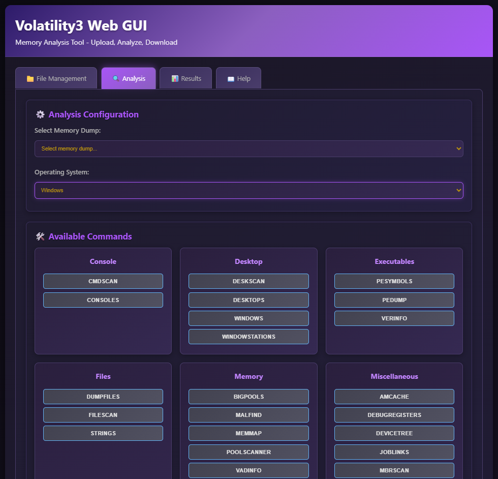

# Volatility3 GUI / Web Interface

## Overview

This repo is a web tool for analyzing memory dumps using the Volatility3 framework. It provides a user-friendly interface for uploading memory images, selecting volatility analysis options, and viewing results. Output goes to the data folder created on docker start.

>_VMEM require vmss support files._

## Docker Quick Start

From where you want to run the Docker container the default setup will create a data folder. This is where you can move or copy your memory images if you want to bypass the http upload method.



### **Build it**

```bash
git clone https://github.com/Jonesckevin/Volatility3-WebGui-Docker.git ./vol3-web
cd vol3-web

docker build -t vol3-web .

docker run -p 8080:5000 -v ./data:/data vol3-web

## Docker Compose up
#docker-compose up -d --build
```

```powershell
## Over Engineered Setup

# Start the Docker containers
.\start-docker.ps1 -ServiceProfile PROFILE
                                  #  basic      - Core Volatility web interface only (default)
                                  #  files      - Core + File Browser
                                  #  monitoring - Core + Prometheus + Grafana
                                  #  logging    - Core + ELK Stack
                                  #  full       - All services
```

### Pull it

```bash
## Docker Pull
docker pull jonesckevin/vol3-web
docker run -d -p 8080:5000 -v ./data:/data jonesckevin/vol3-web
```

### Access the web interface

`"http://localhost:8080"`

## Usage

### 1. **File Management Tab**

- **Upload**: Manually move data to /data/ folder of the container. From UI, drag memory dumps directly onto the upload area or click to browse
- **Manage**: View, download, and delete uploaded files
- **Supported Formats**: .dd, .raw, .mem, .dmp, .img, .vmem(bring vmss file), .bin

### 2. **Analysis Tab**

- **Select Memory Dump**: Choose from uploaded files
- **Choose OS**: Select Windows, Linux, Mac
- **Run Commands**: Click any command button to instantly start analysis
- **Error Handling**: Failed commands show detailed error output including Volatility help menus for syntax errors

### 3. **Results Tab**

- **View Results**: Browse all generated analysis output files placed into the data folder
- **Download**: Get analysis results as timestamped text files
- **Manage**: Delete old results to free up space

## 🔒 Security Considerations

- Container runs as root for forensic tool compatibility
- Consider mounting evidence as read-only: `-v ./data:/data:ro`
- Recommend using in a more restricted setup because the WebUI does have command type permissions as root inside Docker. Not a production type tool. Unless production to you means anytime.
- Limit network access if processing sensitive data
- Use Docker's built-in security features like user namespaces, seccomp profiles, and AppArmor/SELinux policies to further restrict container capabilities
